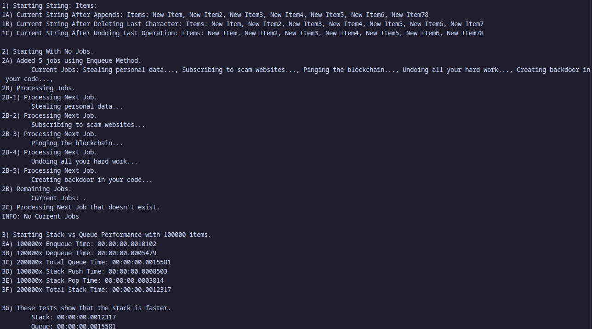

# Reflection Questions

A. The stack handled operations slightly faster

B. They were about the same difficulty to implement, but the stack wrapper class was easier due to needing less error checking for their actions.

C. A stack would be preffered when items only need to be pulled and pushed on the top like a history or buffer. A queue would be better in the case of a ticketing system where the oldest item is the most important.

